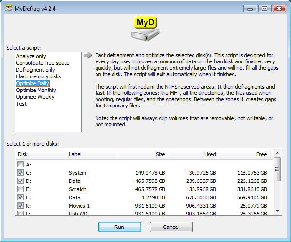
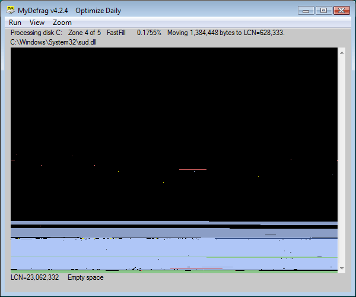

## MyDefrag v4.3.1

|                   |      |                                                                                                                                                                                                                                                                                                                                                                                                                                                                                                                                                                                                                                                         |
|:------------------|:-----|---------------------------------------------------------------------------------------------------------------------------------------------------------------------------------------------------------------------------------------------------------------------------------------------------------------------------------------------------------------------------------------------------------------------------------------------------------------------------------------------------------------------------------------------------------------------------------------------------------------------------------------------------------|
|  |      | MyDefrag is a disk defragmenter and optimizer (a maintenance utility to make your harddisk faster) for Windows 2000, 2003, XP, Vista, 2008, Win7, and for X64. It is freeware, no time limit, fully functional, no advertisements. Fast, low overhead, with many optimization strategies, can handle floppies, USB disks, memory sticks, and anything else that looks like a disk to Windows. Included are a set of easy to use scripts for endusers, a scripting engine for demanding users, a screensaver, and a combined Windows plus commandline version that can be scheduled by the Windows task scheduler or for use from administrator scripts. |

|                                                                      |      |                                                               |
|:--------------------------------------------------------------------:|:----:|:-------------------------------------------------------------:|
|                   Snapshots of MyDefrag in action                    |      |                                                               |
|  |      |  |

[TABLE]

---

_Source HTML: `index.html`_
